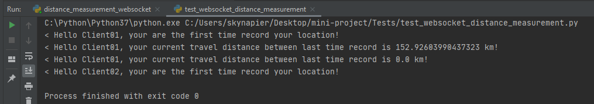

## How to run program?
## From local environment
#### task 1 time converter
run python ./parsing_csv_program  
output at ./Input_csv_files/timezone_modified.csv  
test case run python ./Test/test_timezone_converter.py  

#### task 2 restful api
run python ./app.py  
output at ./Input_csv_files/timezone_modified.csv  
test case run python ./Test/test_restful_api.py  
url= 127.0.0.1:5000/api/1.0/time-converter full restful instruction at below  

#### task 3 websocket live measurement
run python ./Websocket_1_0/live_measurements_websockets.py  
test case run python ./Test/test_websocket_live_measurement.py  
url = "ws://127.0.0.1:5001"  
##### sample output:
pass data 1 times: 
clientname = Client01; lat, lng = -33.865143, 151.209900; timestamp = 1480933800 
return:  

#### task 4 websocket distance measurement
run python ./Websocket_1_0/distance_measurements_websockets.py  
test case run python ./Test/test_websocket_distance_measurement.py  
url = "ws://127.0.0.1:5002"  
##### sample output:
pass data 4 times: 
name:Client01,lat:32.000431,lng:-103.548851 
name:Client01,lat:33.374939,lng:-103.604195 
name:Client01,lat:33.374939,lng:-103.604195 
name:Client02,lat:33.374939,lng:-103.604195 
return:  
it will count distance between 2rd and 3nd times send data, 3nd time send same data the distance should be 0. 1st and 4th data are the first record in the system, thus do not count the distance.

## From Docker Image
### Build Image from dockerfile
## docker building command
docker build -t mini-project:tag .

#### task 1 time converter
Either:  volume where you save timezone.csv then output with same folder 
docker run --rm --name mini-project-time-converter -v \where you save csv file\:\mini-project\Input_csv_files skynapier/mini-project:1.0 parsing_csv_program.py

OR:  
docker run --rm --name mini-project-time-converter skynapier/mini-project:1.0 parsing_csv_program.py  
and 
docker cp <contianer id>:Input_csv_file \where in your host to save\ 

#### task 2 restful api
docker run --name mini-project-restful-api -d -p 5000:5000 skynapier/mini-project:1.0 app.py  

then test with postman or someothers.

#### task 3 websocket live measurement
docker run --name mini-project-websocket-live-measurement -d -p 5001:5001 skynapier/mini-project:1.0 live_measurements_websocket.py

#### task 4 websocket distance measurement
docker run --name mini-project-websocket-distance-measurement -d -p 5002:5002 skynapier/mini-project:1.0 distance_measurements_websocket.py

## Restful API
### GET all
127.0.0.1:5000/api/1.0/time-converter/all 

### GET by id
127.0.0.1:5000/api/1.0/time-converter/73k 

### POST 
#### Post ADD id not exist
127.0.0.1:5000/api/1.0/time-converter/add/?id=1&lat=-33.865143&lng=151.209900&timestamp=1480933800 

#### Post ADD id exist
127.0.0.1:5000/api/1.0/time-converter/add/?id=1&lat=-33.865143&lng=151.209900&timestamp=1480933800 

### PUT 
#### PUT update with id  exist
127.0.0.1:5000/api/1.0/time-converter/0/?lat=-33.865143&lng=151.209900&timestamp=1480933800 

#### PUT update with id not exist
127.0.0.1:5000/api/1.0/time-converter/99/?lat=-33.865143&lng=151.209900&timestamp=1480933800 

### Delete 

#### Delete successful
127.0.0.1:5000/api/1.0/time-converter/0 

#### Delete fail
127.0.0.1:5000/api/1.0/time-converter/9527 

## File Structure
mini-project  
├── Controllers_1_0  
│&nbsp;&nbsp;&nbsp;&nbsp;&nbsp;├── __init__.py  
│&nbsp;&nbsp;&nbsp;&nbsp;&nbsp;└── time_converter_controller.py  
├── Input_csv_files  
│&nbsp;&nbsp;&nbsp;&nbsp;&nbsp;├── timezone.csv  
│&nbsp;&nbsp;&nbsp;&nbsp;&nbsp;└── timezone_modified.csv 
├── Tests  
│&nbsp;&nbsp;&nbsp;&nbsp;&nbsp;├── __init__.py  
│&nbsp;&nbsp;&nbsp;&nbsp;&nbsp;├── test_restful.py  
│&nbsp;&nbsp;&nbsp;&nbsp;&nbsp;├── test_timezone_converter.py  
│&nbsp;&nbsp;&nbsp;&nbsp;&nbsp;├── test_websocket_distance_measurement.py  
│&nbsp;&nbsp;&nbsp;&nbsp;&nbsp;└── test_websocket_live_measurementr.py  
├── Utils  
│&nbsp;&nbsp;&nbsp;&nbsp;&nbsp;├── __init__.py  
│&nbsp;&nbsp;&nbsp;&nbsp;&nbsp;├── csv_file_parser.py  
│&nbsp;&nbsp;&nbsp;&nbsp;&nbsp;├── distance_measurement.py  
│&nbsp;&nbsp;&nbsp;&nbsp;&nbsp;└── timezone_converter_utils.py  
├── Websocket_1_0  
│&nbsp;&nbsp;&nbsp;&nbsp;&nbsp;├── distance_measurement_websocket.py  
│&nbsp;&nbsp;&nbsp;&nbsp;&nbsp;└── live_measurement_websocket.py  
├── app.py  
├── config.py  
├── Dockerfile  
├── parsing_csv_program.py  
└── startup.py  

